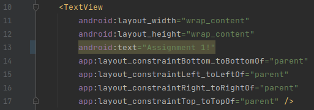

# Rapport

För att ändra texten Hello world, behöver man öppna filen res/layout/content_main.xml på rad 13.
Innan ändringen såg det ut såhär:
```
<TextView
        android:layout_width="wrap_content"
        android:layout_height="wrap_content"
        android:text="Hello world!"
        app:layout_constraintBottom_toBottomOf="parent"
        app:layout_constraintLeft_toLeftOf="parent"
        app:layout_constraintRight_toRightOf="parent"
        app:layout_constraintTop_toTopOf="parent" />
```
Efter ändringen: (rader som inte ändrats har utelämnats).
```
   android:text="Assignment 1!"
```

